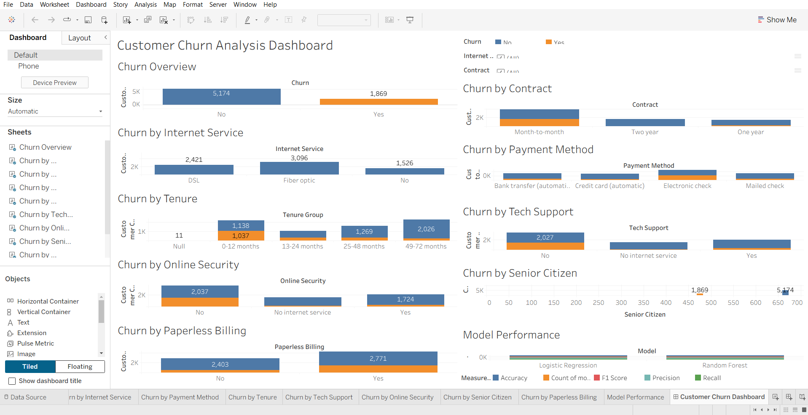

# Customer Churn Analysis

## Project Overview

Customer Churn Analysis is a data analytics and machine learning project that analyzes customer behavior and identifies factors that contribute to customer churn.

## Objectives

- Analyze customer churn patterns
- Identify factors affecting churn
- Perform data cleaning and exploratory data analysis
- Build machine learning models to predict churn
- Compare Logistic Regression and Random Forest
- Create a Tableau dashboard

## Dataset

IBM Telco Customer Churn Dataset

- Records: 7,043 customers
- Features: 21 attributes
- Target: Customer Churn

## Technologies Used

- Python
- Pandas
- NumPy
- Matplotlib
- Seaborn
- Scikit-learn
- Jupyter Notebook
- Tableau Public

## Analysis Performed

- Data Cleaning
- Exploratory Data Analysis
- Churn Analysis
- Contract Analysis
- Internet Service Analysis
- Payment Method Analysis
- Tenure Analysis
- Monthly Charges Analysis
- Tech Support Analysis
- Online Security Analysis
- Correlation Analysis
- Churn Probability Prediction
- Risk Analysis
- Feature Importance

## Machine Learning Models

### Logistic Regression

- Accuracy: 79.91%
- Precision: 65.22%
- Recall: 52.14%
- F1 Score: 57.95%

### Random Forest

- Accuracy: 78.85%
- Precision: 62.93%
- Recall: 49.47%
- F1 Score: 55.39%

## Model Comparison

| Model | Accuracy | Precision | Recall | F1 Score |
|---|---:|---:|---:|---:|
| Logistic Regression | 79.91% | 65.22% | 52.14% | 57.95% |
| Random Forest | 78.85% | 62.93% | 49.47% | 55.39% |

## Key Findings

- Month-to-month contract customers have higher churn.
- Higher monthly charges are associated with higher churn.
- Fiber optic customers show relatively higher churn.
- Customers without online security or tech support are more likely to churn.
- Longer-tenure customers generally have lower churn.
- Logistic Regression performed slightly better than Random Forest.

## Tableau Dashboard



## Project Structure

```text
Customer-Churn-Analysis/
├── data/
├── notebooks/
├── dashboard/
├── dashboard.png
├── README.md
├── Customer_Churn_Analysis.twbx
├── churn_summary.csv
├── cleaned_customer_churn.csv
├── model_performance.csv
└── requirements.txt
